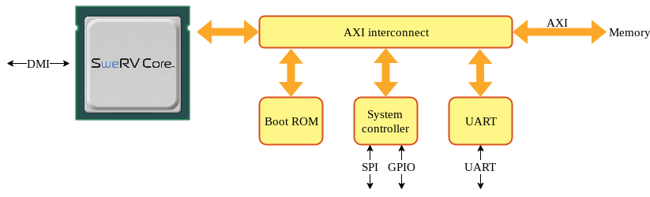
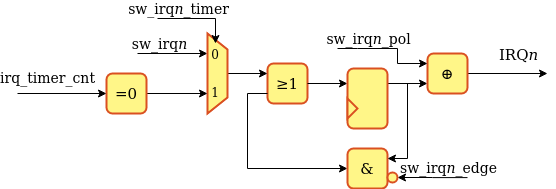
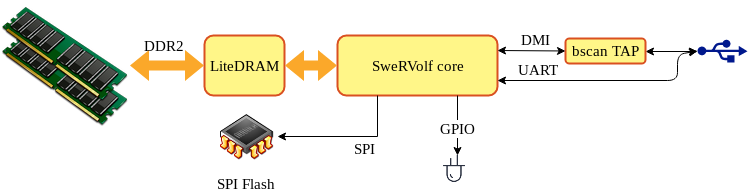

SweRVolf
========

SweRVolf is a [FuseSoC](https://github.com/olofk/fusesoc)-based reference platform for the SweRV family of RISC-V cores. Currently, [SweRV EH1](https://github.com/chipsalliance/Cores-SweRV) and [SweRV EL2](https://github.com/chipsalliance/Cores-SweRV-EL2) are supported. See [CPU configuration](#cpu-configuration) to learn how to switch between them.

This can be used to run the [RISC-V compliance tests](https://github.com/riscv/riscv-compliance), [Zephyr OS](https://www.zephyrproject.org), [TockOS](https://github.com/tock/tock/tree/master/boards/swervolf) or other software in simulators or on FPGA boards. Focus is on portability, extendability and ease of use; to allow SweRV users to quickly get software running, modify the SoC to their needs or port it to new target devices.

# Structure

To ease portability, the SoC consists of a portable technology-agnostic core with target-specific wrappers. This chapter describes the functionality of the core and the technology-specific targets.

## SweRVolf Core

The core of SweRVolf consists of the SweRV CPU with a boot ROM, AXI4 interconnect, UART, SPI, RISC-V timer and GPIO. The core doesn't include any RAM but instead exposes a memory bus that the target-specific wrapper will connect to an appropriate memory controller. Other external connections are clock, reset, UART, GPIO, SPI and DMI (Debug Module Interface).

*SwerVolf Core*

### Memory map

| Core     | Address               |
| -------- | --------------------- |
| RAM      | 0x00000000-0x07FFFFFF |
| Boot ROM | 0x80000000-0x80000FFF |
| syscon   | 0x80001000-0x80001FFF |
| UART     | 0x80002000-0x80002FFF |

#### RAM

The SweRVolf core does not contain a memory controller but allocates the first 128MiB of the address for RAM that can be used by a target application and exposes an AXI bus to the wrapper.

#### Boot ROM

The boot ROM contains a first-stage bootloader. After system reset, SweRV will start fetching its first instructions from this area.

To select a bootloader, set the `bootrom_file` parameter. See the [Booting](#booting) chapter for more information about available bootloaders.

#### System controller

The system controller contains common system functionality such as keeping register with the SoC version information, RAM initialization status and the RISC-V machine timer. Below is the memory map of the system controller

| Address  | Register              | Description |
| -------- | --------------------- | -----------
| 0x00     | version_patch | SweRVolf patch version |
| 0x01     | version_minor | SweRVolf minor version |
| 0x02     | version_major |SweRVolf major version |
| 0x03     | version_misc | Bit 7 is set when SweRVolf was built from modified sources |
|          |              | Bit 6:0 revision since last patch version |
| 0x04-0x07     | version_sha | SHA hash of the build
| 0x08     | sim_print | Outputs a character in simulation. No effect on hardware
| 0x09     | sim_exit | Exits a simulation. No effect on hardware
| 0x0A     | init_status | Bit 0 = RAM initialization complete. Bit 1 = RAM initialization reported errors
| 0x0B     | sw_irq                | Software-controlled external interrupts
| 0x0C-0x0F | nmi_vec | Interrupt vector for NMI |
| 0x10-0x13 | gpio0 | 32 readable and writable GPIO bits |
| 0x18-0x1B | gpio1 | 32 readable and writable GPIO bits |
| 0x20-0x27 | mtime | mtime from RISC-V privilege spec |
| 0x28-0x2f | mtimecmp |mtimecmp from RISC-V privilege spec |
| 0x30-0x33 | irq_timer_cnt | IRQ timer counter |
| 0x34      | irq_timer_ctrl | IRQ timer control |
| 0x3C-0x3F | clk_freq_hz | Clock frequency of main clock in Hz |
| 0x40     | SPI_SPCR | Simple SPI Control register |
| 0x48     | SPI_SPSR | Simple SPI status register |
| 0x50     | SPI_SPDR | Simple SPI data register |
| 0x58     | SPI_SPER | Simple SPI extended register |
| 0x60     | SPI_SPSS | Simple SPI slave select register |

##### syscon_base+0x000B sw_irq

This register allows configuration and assertion of IRQ line 3 and 4, for testing the SweRV PIC or having two extra software-controllable interrupt sources. Interrupts can be triggered by writing to the sw_irq*n* bits when the timer bit is set to 0, or by a timeout of the irq_timer, when the timer bit is set to one. If both sw_irq3_timer and sw_irq4_timer are set to 0, the IRQ timer instead asserts an NMI when it reaches 0.

If sw_irq3_timer or sw_irq4_timer are asserted, the interrupt trigger is connected to 

| Bits | Name         | Description |
| ---- | ------------ | -----------
|    7 | sw_irq4      | Trigger IRQ line 4
|    6 | sw_irq4_edge | 0 = IRQ4 is asserted until sw_irq4 is cleared, 1 = Writing to sw_irq4 only asserts IRQ4 for one clock cycle
|    5 | sw_irq4_pol  | IRQ4 polarity. 0 = Active high, 1 = active low
|    4 | sw_irq4_timer| 0 = IRQ4 is triggered by sw_irq4, 1 = IRQ4 is triggered by irq_timer timeout
|    3 | sw_irq3      | Trigger IRQ line 3
|    2 | sw_irq3_edge | 0 = IRQ3 is asserted until sw_irq3 is cleared, 1 = Writing to sw_irq3 only asserts IRQ3 for one clock cycle
|    1 | sw_irq3_pol  | IRQ3 polarity. 0 = Active high, 1 = active low
|    0 | sw_irq3_timer| 0 = IRQ3 is triggered by sw_irq3, 1 = IRQ3 is triggered by irq_timer timeout

##### syscon_base+0x0030 irq_timer_cnt

Set or read the IRQ timer counter value. Granularity is in system clock frequency cycles.

##### syscon_base+0x0034 irq_timer_en

Bit 0 enables or disables one-shot IRQ countdown timer. Automatically disables itself when reaching zero

#### UART

SweRVolf contains a ns16550-compatible UART

## SweRVolf sim

SweRVolf sim is a simulation target that wraps the SweRVolf core in a testbench to be used by verilator or event-driven simulators such as QuestaSim. It can be used for full-system simulations that executes programs running on SweRV. It also supports connecting a debugger through OpenOCD and JTAG VPI. The [Debugging](#debugging) chapter contains more information on how to connect a debugger.

*SwerVolf Simulation target*

The simulation target exposes a number of parameters for compile-time and run-time configuration. These parameters are all exposed as FuseSoC parameters. The most relevant parameters are:

* `--jtag_vpi_enable` : Enables the JTAG server which OpenOCD can connect to
* `--ram_init_file` : Loads a Verilog hex file to use as initial on-chip RAM contents
* `--vcd` : Enable VCD dumping

Memory files suitable for loading with `--ram_init_file` can be created from binary files with the `sw/makehex.py` script

## SweRVolf Nexys

SweRVolf Nexys is a version of the SweRVolf SoC created for the Digilent Nexys A7 board. It uses the on-board 128MB DDR2 for RAM, has GPIO connected to LED, supports booting from SPI Flash and uses the microUSB port for UART and JTAG communication. The default bootloader for the SweRVolf Nexys target will attempt to load a program stored in SPI Flash by default.

*SwerVolf Nexys A7 target*

### I/O

The active on-board I/O consists of a LED, a switch and the microUSB connector for UART, JTAG and power.

#### LEDs

16 LEDs are controlled by memory-mapped GPIO at address 0x80001010-0x80001011

#### Switches

16 Switches are mapped GPIO addresses at 0x80001012-0x80001013

During boot up, the two topmost switches (sw14, sw15) control the boot mode.

| sw15 | sw14 | Boot mode                  |
| ---- | ---- | -------------------------- |
|  off |  off | Boot from SPI Flash        |
|  off |   on | Boot from serial           |
|   on |  off | Boot from address 0 in RAM |
|   on |   on | Undefined                  |

*Note: Switch 0 has a dual purpose and selects whether to output serial communication from the SoC (0=off) or from the embedded self-test program in the DDR2 controller (1=on).*

#### micro USB

UART and JTAG communication is tunneled through the microUSB port on the board and will appear as `/dev/ttyUSB0`, `/dev/ttyUSB1` or similar depending on OS configuration. A terminal emulator can be used to connect to the UART (e.g. by running `screen /dev/ttyUSB0 115200`) and OpenOCD can connect to the JTAG port to program the FPGA or connect the debug proxy. The [debugging](#debugging) chapter goes into more detail on how to connect a debugger.

#### SPI Flash

An SPI controller is connected to the on-board SPI Flash. This can be used for storing data such as program to be loaded into memory during boot. The [SPI uImage loader](#spi-uimage-loader) chapter goes into more detail on how to prepare, write and boot a program stored in SPI Flash

## SweRVolf Basys 3

SweRVolf Basys 3 is a version of the SweRVolf SoC created for the Digilent Basys 3 board. It uses 64kB on-chip memory for RAM, has GPIO connected to LEDs and switches, supports booting from SPI Flash and uses the microUSB port for UART and JTAG communication. The default bootloader for the SweRVolf Basys 3 target will attempt to load a program stored in SPI Flash by default.

*SwerVolf Basys 3 target*

### I/O

The active on-board I/O consists of LEDs, switches and the microUSB connector for UART, JTAG and power.

#### LEDs

16 LEDs are controlled by memory-mapped GPIO at address 0x80001010-0x80001011

#### Switches

16 Switches are mapped GPIO addresses at 0x80001012-0x80001013

During boot up, the two topmost switches (sw14, sw15) control the boot mode.

| sw15 | sw14 | Boot mode                  |
| ---- | ---- | -------------------------- |
|  off |  off | Boot from SPI Flash        |
|  off |   on | Boot from serial           |
|   on |  off | Boot from address 0 in RAM |
|   on |   on | Undefined                  |

#### micro USB

UART and JTAG communication is tunneled through the microUSB port on the board and will appear as `/dev/ttyUSB0`, `/dev/ttyUSB1` or similar depending on OS configuration. A terminal emulator can be used to connect to the UART (e.g. by running `screen /dev/ttyUSB0 115200`) and OpenOCD can connect to the JTAG port to program the FPGA or connect the debug proxy. The [debugging](#debugging) chapter goes into more detail on how to connect a debugger.

#### SPI Flash

An SPI controller is connected to the on-board SPI Flash. This can be used for storing data such as program to be loaded into memory during boot. The [SPI uImage loader](#spi-uimage-loader) chapter goes into more detail on how to prepare, write and boot a program stored in SPI Flash

# How to use

## Prerequisites

Install [verilator](https://www.veripool.org/wiki/verilator)

Create an empty directory, e.g. named swervolf, to use as the root of the project. This directory will from now on be called `$WORKSPACE`. All further commands will be run from `$WORKSPACE` unless otherwise stated. After entering the workspace directory, run `export WORKSPACE=$(pwd)` to set the $WORKSPACE shell variable.

1. Make sure you have [FuseSoC](https://github.com/olofk/fusesoc) version 1.12 or newer installed or install it with `pip install fusesoc`
2. Add the FuseSoC base library to the workspace with `fusesoc library add fusesoc-cores https://github.com/fusesoc/fusesoc-cores`
3. Add the swervolf library with `fusesoc library add swervolf https://github.com/chipsalliance/Cores-SweRVolf`
4. Make sure you have verilator installed to run the simulation. **Note** This requires at least version 3.918. The version that is shipped with Ubuntu 18.04 will NOT work

Your workspace shall now look like this:

    $WORKSPACE
    └──fusesoc_libraries
       ├──fusesoc-cores
       └──swervolf

After step 3, the SweRVolf sources will be located in `$WORKSPACE/fusesoc_libraries/swervolf`. For convenience, this directory will from now on be refered to as `$SWERVOLF_ROOT`. Run `export SWERVOLF_ROOT=$WORKSPACE/fusesoc_libraries/swervolf` to set this as a shell variable

## Running the SoC

The SweRVolf SoC can be run in simulation or on hardware (Digilent Nexys A7 currently supported). In either case FuseSoC is used to launch the simulation or build and run the FPGA build. To select what to run, use the `fusesoc run` command with the `--target` parameter. To run in simulation use

    fusesoc run --target=sim swervolf

This will load a small example program that prints a string and exits. If you want to rerun the program without rebuilding the simulation model, you can add the --run parameter

    fusesoc run --target=sim --run swervolf

To build (and optionally program) an image for a Nexys A7 board, run

    fusesoc run --target=nexys_a7 swervolf

All targets support different compile- and run-time options. To see all options for a target run

    fusesoc run --target=$TARGET swervolf --help

To list all available targets, run

    fusesoc core show swervolf

To build and run on Riviera-Pro simulator

    fusesoc run --target=sim --tool=rivierapro swervolf

After building any of the targets, there will now be a `build` in your workspace. This directory contains everything needed to rebuild the target. It can be safely removed and gets rebuilt when building a target again. To use a different build directory, pass `--build-root=<output dir>` to the run arguments.

### Run a precompiled example in simulation

In simulation, SweRVolf supports preloading an application to memory with the `--ram_init_file` parameter. SweRVolf comes bundled with some example applications in the `sw` directory.

To build the simulation model and run the bundled Zephyr Hello world example in a simulator. `fusesoc run --target=sim swervolf --ram_init_file=$SWERVOLF_ROOT/sw/zephyr_hello.vh`.
To build and run this example on Riviera-Pro: `fusesoc run --target=sim --tool=rivierapro swervolf --ram_init_file=$SWERVOLF_ROOT/sw/zephyr_hello.vh`.

After running the above command, the simulation model should be built and run. At the end it will output

    Releasing reset
    ***** Booting Zephyr OS zephyr-v1.14.0 *****
    Hello World! swervolf_nexys

At this point the simulation can be aborted with `Ctrl-C`.

Another example to run is the Zephyr philosophers demo.

    fusesoc run --run --target=sim swervolf --ram_init_file=$SWERVOLF_ROOT/sw/zephyr_philosophers.vh

* Note the `--run` option which will prevent rebuilding the simulator model

### Run RISC-V compliance tests

**Note:** The following instructions are valid for version 1.0 of the RISC-V compliance tests. The target-specific support for SweRVolf has not yet been ported to newer versions.

1. Build the simulation model, if that hasn't already been done, with `fusesoc run --target=sim --setup --build swervolf`
2. Download the RISC-V compliance tests to the workspace with `git clone https://github.com/riscv/riscv-compliance --branch 1.0`. Your directory structure should now look like this:

        $WORKSPACE
        ├──build
        ├──fusesoc_libraries
        └──riscv-compliance

3. Enter the riscv-compliance directory and run `make TARGETDIR=$SWERVOLF_ROOT/riscv-target RISCV_TARGET=swerv RISCV_DEVICE=rv32i RISCV_ISA=rv32i TARGET_SIM=$WORKSPACE/build/swervolf_0.7.4/sim-verilator/Vswervolf_core_tb`

*Note: Other test suites can be run by replacing RISCV_ISA=rv32imc with rv32im or rv32i*

*Note: The `TARGET_SIM` path needs to be updated to reflect the actual location of `Vswervolf_core_tb`*

### Run on hardware

The SweRVolf SoC can be built for a Digilent Nexys A7 board with

    fusesoc run --target=nexys_a7 swervolf

If the board is connected, it will automatically be programmed when the FPGA image has been built. It can also be programmed manually afterwards by running `fusesoc run --target=nexys_a7 --run swervolf` or running OpenOCD as described in the debugging chapter.

The default bootloader will boot from SPI Flash, RAM or serial depending on the boot mode set by the switches. The default bootloader can be replaced with the `--bootrom_file` parameter. Note that the boot ROM is not connected to the data port, so it can only execute instructions. Data can not be read or written to this segment. The below example will compile the memtest application and use that as boot ROM instead.

    make -C ../cores/Cores-SweRVolf/sw memtest.vh
    fusesoc run --target=nexys_a7 swervolf --bootrom_file=$SWERVOLF_ROOT/sw/memtest.vh

## Build Zephyr applications

        $WORKSPACE
        ├──fusesoc_libraries
        ├──...
        └──zephyr

1.Create a West (Zephyr's build tool) workspace in the same directory as the FuseSoC workspace by running
    west init
2. Add the SweRVolf-specific drivers and BSP with

    west config manifest.path fusesoc_libraries/swervolf
    west update

   The workspace should now look like this

        $WORKSPACE
        ├──fusesoc_libraries
        |  ├──...
        |  └──swervolf
        ├──...
        └──zephyr

3. Enter the directory of the application to build. Zephyr comes with a number of example applications in the samples directory (`$WORKSPACE/zephyr/samples`), e.g. `$WORKSPACE/zephyr/samples/basic/blinky` contains the Zephyr blinky example. From now on, the program to build and run will be called `$APP`
4. Build the code with `west build -b swervolf_nexys`

After building the code there will now be an executable .elf file in `build/zephyr/zephyr.elf` and a binary file in `build/zephyr/zephyr.bin`. The executable file can be loaded into SwerVolf with a debugger and the binary file can be further converted and loaded into RAM for simulations.

To load the .elf file with a debugger, see [Loading programs with OpenOCD](#loading-programs-with-openocd)

To use the .bin file in a simulator, it must first be converted into a suitable verilog hex file. From the directory where the application was built, run
    `python3 $SWERVOLF_ROOT/sw/makehex.py build/zephyr/zephyr.bin > $WORKSPACE/$APP.hex` to create a hex file in the workspace directory. This can now be loaded into a simulator with

    fusesoc run --target=sim swervolf --ram_init_file=$APP.hex

The SweRVolf demo application in `$SWERVOLF_ROOT/sw/swervolf_zephyr_demo` is also a Zephyr program and can be built in the same way

## Debugging

SweRVolf supports debugging both on hardware and in simulation. There are different procedures on how to connect the debugger, but once connected, the same commands can be used (although it's a lot slower in simulations).

### Prerequisites

Install the RISC-V-specific version of OpenOCD. (The OpenOCD code shall be no older than commit 22d771d2 from Sep 14, 2020.)

    git clone https://github.com/riscv/riscv-openocd
    cd riscv-openocd
    ./bootstrap
    ./configure --enable-jtag_vpi --enable-ftdi
    make
    sudo make install

### Connecting debugger to simulation

When a SweRVolf simulation is launched with the `--jtag_vpi_enable`, it will start a JTAG server waiting for a client to connect and send JTAG commands.

    fusesoc run --target=sim swervolf --jtag_vpi_enable

After compilation, the simulation should now say

    Listening on port 5555

This means that it's ready to accept a JTAG client.

Open a new terminal, navigate to the workspace directory and run `openocd -f $SWERVOLF_ROOT/data/swervolf_sim.cfg` to connect OpenOCD to the simulation instance. If successful, OpenOCD should output

    Info : only one transport option; autoselect 'jtag'
    Info : Set server port to 5555
    Info : Set server address to 127.0.0.1
    Info : Connection to 127.0.0.1 : 5555 succeed
    Info : This adapter doesn't support configurable speed
    Info : JTAG tap: riscv.cpu tap/device found: 0x00000001 (mfg: 0x000 (<invalid>), part: 0x0000, ver: 0x0)
    Info : datacount=2 progbufsize=0
    Warn : We won't be able to execute fence instructions on this target. Memory may not always appear consistent. (progbufsize=0, impebreak=0)
    Info : Examined RISC-V core; found 1 harts
    Info :  hart 0: XLEN=32, misa=0x40001104
    Info : Listening on port 3333 for gdb connections
    Info : Listening on port 6666 for tcl connections
    Info : Listening on port 4444 for telnet connections

and the simulation should report

    Waiting for client connection...ok
    Preloading TOP.swervolf_core_tb.swervolf.bootrom.ram from jumptoram.vh
    Releasing reset

Open a third terminal and connect to the debug session through OpenOCD with `telnet localhost 4444`. From this terminal, it is now possible to view and control the state of of the CPU and memory. Try this by running `mwb 0x80001010 1`. This will write to the GPIO register. To verify that it worked, there should now be a message from the simulation instance saying `gpio0 is on`. By writing 0 to the same register (`mwb 0x80001010 0`), the gpio will be turned off.

### Connecting debugger to Nexys A7

SweRVolf can be debugged using the same USB cable that is used for programming the FPGA, communicating over UART and powering the board. There is however one restriction. If the Vivado programmer has been used, it will have exclusive access to the JTAG channel. For that reason it is recommended to avoid using the Vivado programming tool and instead use OpenOCD for programming the FPGA as well. Unplugging and plugging the USB cable back will make Vivado lose the grip on the JTAG port.

Programming the board with OpenOCD can be performed by running (from $WORKSPACE)

    openocd -f $SWERVOLF_ROOT/data/swervolf_nexys_program.cfg

To change the default FPGA image to load, add `-c "set BITFILE /path/to/bitfile"` as the first argument to openocd.

If everything goes as expected, this should output

    Info : ftdi: if you experience problems at higher adapter clocks, try the command "ftdi_tdo_sample_edge falling"
    Info : clock speed 10000 kHz
    Info : JTAG tap: xc7.tap tap/device found: 0x13631093 (mfg: 0x049 (Xilinx), part: 0x3631, ver: 0x1)
    Warn : gdb services need one or more targets defined
    loaded file build/swervolf_0/nexys_a7-vivado/swervolf_0.bit to pld device 0 in 3s 201521us
    shutdown command invoked

OpenOCD can now be connected to SweRVolf by running

    openocd -f $SWERVOLF_ROOT/data/swervolf_nexys_debug.cfg

This should output

    Info : ftdi: if you experience problems at higher adapter clocks, try the command "ftdi_tdo_sample_edge falling"
    Info : clock speed 10000 kHz
    Info : JTAG tap: riscv.cpu tap/device found: 0x13631093 (mfg: 0x049 (Xilinx), part: 0x3631, ver: 0x1)
    Info : datacount=2 progbufsize=0
    Warn : We won't be able to execute fence instructions on this target. Memory may not always appear consistent. (progbufsize=0, impebreak=0)
    Info : Examined RISC-V core; found 1 harts
    Info :  hart 0: XLEN=32, misa=0x40001104
    Info : Listening on port 3333 for gdb connections
    Info : Listening on port 6666 for tcl connections
    Info : Listening on port 4444 for telnet connections

Open a third terminal and connect to the debug session through OpenOCD with `telnet localhost 4444`. From this terminal, it is now possible to view and control the state of of the CPU and memory. Try this by running `mwb 0x80001010 1`. This will write to the GPIO register. To verify that it worked, LED0 should light up. By writing 0 to the same register (`mwb 0x80001010 0`), the LED will be turned off.

### Loading programs with OpenOCD

OpenOCD support loading ELF program files by running `load_image /path/to/file.elf`. Remember that the path is relative to the directory from where OpenOCD was launched.

After the program has been loaded, set the program counter to address zero with `reg pc 0` and run `resume` to start the program.

## Booting

SweRVolf is set up by default to read its initial instructions from address 0x80000000 which point to the on-chip boot ROM. A default bootloader is provided which has the capability to boot from SPI Flash, RAM or serial depending on the GPIO pins connected to bits 7:6 in register 0x80001013. The table below summarizes the boot modes

| bit7 | bit6 | Boot mode         |
| ---- | ---- | ----------------- |
|    0 |    0 | SPI uImage loader |
|    0 |    1 | Jump to RAM       |
|    1 |    0 | Serial boot       |
|    1 |    1 | Undefined         |

### Jump to RAM

For simulations, the most common option is to load a program into the on-chip RAM and start executing from there. The default bootloader in such cases is a single instruction that jumps to address 0x0 and continues execution from there.

### SPI uImage loader

For most applications on real hardware it is preferred to store them in an on-board SPI Flash memory. The SPI uImage loader can read an image in the u-boot uImage format, copy it to RAM and start executing. This process requires creating a suitable image, writing it to Flash and set up the SPI uImage loader to read from the correct address in Flash.

#### Create a flash image

The `mkimage` tool available from u-boot is used to prepare an image to be written to Flash. `mkimage` expects a `.bin` file, which has been created with `iscv64-unknown-elf-objcopy -O binary`. Given a `$IMAGE.bin` we can now create `$IMAGE.ub` with the following command:

    mkimage -A riscv -C none -T standalone -a 0x0 -e 0x0 -n '' -d $IMAGE.bin $IMAGE.ub

Refer to the uimage manual for a description of each parameter. There are also Makefile targets in `$SWERVOLF_ROOT/sw/Makefile` that can be used as reference.

### Writing SPI Flash

#### Simulation

In order to test the SPI image loading mechanism in simulation, a specific FuseSoC target, `spi_tb` is available. If no run-time parameters are supplied it will load a prebuilt image containing the `hello` program (source available in `sw/hello.S`) from Flash, execute it and exit. This testbench will not work in Verilator as it uses a non synthesizable model of the SPI Flash. The default simulator is instead ModelSim. Other simulators can be used by adding the `--tool=$TOOL` argument to the command-line.

    fusesoc run --target=spi_tb swervolf

The simulated Flash contents can be changed at compile-time with the `--flash_init_file` parameter. The model expects a uImage in verilog hex format. Such files can be created by running

    objcopy -I binary -O verilog $IMAGE.ub $IMAGE.hex

#### Nexys A7

For Nexys A7, OpenOCD is used to write to Flash. As the connection to the SPI Flash goes through the FPGA, this consists of a two-stage process where a proxy FPGA image is first written, which will handle communication between OpenOCD and the SPI Flash

1. Obtain the proxy FPGA image from [here](https://github.com/quartiq/bscan_spi_bitstreams/blob/master/bscan_spi_xc7a100t.bit) and place it in `$WORKSPACE`
2. Run `openocd -c "set BINFILE $IMAGE" -f $SWERVOLF_ROOT/data/swervolf_nexys_write_flash.cfg`, where `$IMAGE` is the path to the uImage file that should be written to Flash

### Set up SPI uImage loader

The final step is to prepare the bootloader for SweRVolf which will be responsible for reading the image from Flash, copy it to RAM and execute it. This process is the same for both simulation and hardware targets. Note that both the `spi_tb` target and `nexys_a7` target will have this as the default boot loader so in most cases nothing else needs to be done. There are however a couple of defines in `sw/spi_uimage_loader.S` that might need to be adjusted if the SPI controller is mapped to another base address or if the image is not stored at address 0 in the Flash.

### Serial boot

In serial boot mode, the UART waits for a program in Intel Hex format to be sent to the UART. Upon completion, the program will be launched.

## CPU configuration

SweRVolf currently supports the SweRV EH1 and EL2 cores. For all targets SweRV EH1 is used by default unless there are hardware limitations (e.g. FPGA size) that only allows using SweRV EL2. All targets can optionally use SweRV EL2 by passing  `--flag=cpu_el2` as a run option to FuseSoC, e.g. `fusesoc run --target=sim --flag=cpu_el2 swervolf` will run the default simulation example using SweRV EL2. Also note that the max frequency of the processors can differ. E.g. on the Nexys A7 board SweRV EH1 will run at 50MHz while SweRV EL2 runs at 25MHz. The `clk_freq_hz` register in the system controller will always show the correct value. The bootloader and Zephyr board support is also set up to automatically adapt timer and UART speeds to the runtime-detected clock speed.
